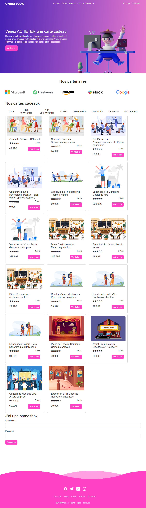

# OmnesBox - Système de Cartes Cadeau

Bienvenue dans le projet OmnesBox, un système de cartes cadeau. Ce projet a été développé dans le cadre du cours de Projet Web Dynamique ING2 2023. OmnesBox vous permet d'acheter des cartes cadeau pour offrir à vos proches ou à vous-même, offrant une variété d'activités passionnantes à choisir.

## Fonctionnalités Principales

- **Cartes Cadeau :** Explorez et achetez des cartes cadeau pour différentes activités, avec la possibilité de filtrer par montant et type d'activité.
- **Panier :** Consultez et validez les cartes cadeau ajoutées à votre panier, avec une simulation de paiement.
- **J'ai une OmnesBox :** Les bénéficiaires des cartes cadeau peuvent saisir le numéro unique de leur carte, créer un compte ou se connecter, et choisir chez quel partenaire dépenser leur carte.
- **Mon Compte :** Gérez votre profil utilisateur, y compris les informations personnelles.

## Types d'Utilisateurs

- **Administrateur :** Gère le site, ajoute/supprime des partenaires, des cartes cadeau, et visualise les utilisateurs et leurs cartes.
- **Partenaire :** Propose des activités, choisit les cartes cadeau auxquelles adhérer, et gère les cartes dépensées chez lui.
- **Utilisateur :** Achète des cartes cadeau, choisit où les dépenser, et gère son compte.

## Fonctionnalités Avancées

- Responsive design pour une expérience utilisateur optimale sur tous les appareils.
- Possibilité de dépenser une carte cadeau sur plusieurs formules d'un même partenaire ou chez plusieurs partenaires.
- Extension d'une carte cadeau à plusieurs activités.
- Intégration de la géolocalisation des partenaires avec Google Maps.
- Implémentation d'un service de paiement en ligne tel que Stripe.

## Livraison et Évaluation

- **Premier livrable (7 mai) :** Conception du projet avec architecture front-end et back-end, maquettes, modèle entité-association de la base de données.
- **Deuxième livrable (23 mai) :** Code source sur GitHub, présentation PowerPoint, rapport de travail individuel et collectif.

